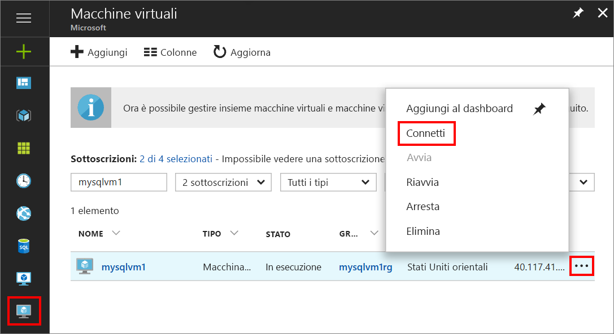

1. Dopo che la macchina virtuale di Azure è stata creata ed è in esecuzione, fare clic sull'icona di Macchine virtuali nel portale di Azure per visualizzare le VM.

1. Fare clic sui puntini di sospensione, **...**, per la nuova VM.

1. Fare clic su **Connetti**.

   

1. Aprire il file **RDP** scaricato dal browser per la VM.

1. La Connessione Desktop remoto invia una notifica che indica che l'autore della connessione remota non può essere identificato. Fare clic su **Connetti** per continuare.

1. Nella finestra di dialogo **Sicurezza di Windows** fare clic su **Usa un account diverso**. Potrebbe essere necessario fare clic su **Altre opzioni** per visualizzare l'opzione. Specificare il nome utente e la password configurati durante la creazione della VM. È necessario aggiungere una barra rovesciata prima del nome utente.

   

1. Fare clic su **OK** per connettersi.