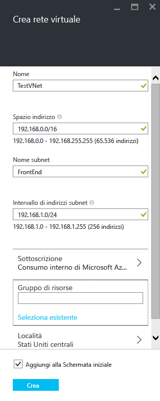
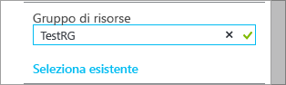
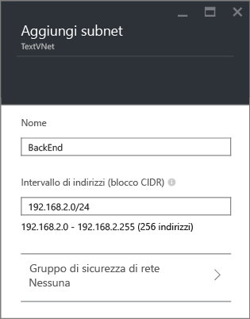
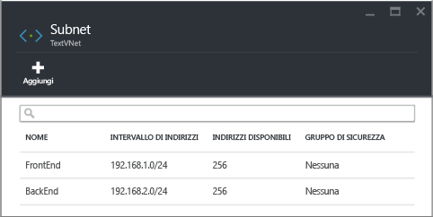

## Come creare una rete virtuale nel portale di anteprima di Azure

Per creare una rete virtuale in base allo scenario precedente tramite il portale di anteprima di Azure, seguire questa procedura.

1. Da un browser, passare a http://portal.azure.com e, se necessario, accedere con l'account Azure.
2. Fare clic su **NUOVO** > **Rete** > **Rete virtuale**, quindi fare clic su **Gestione risorse** dall'elenco **Selezionare un modello di distribuzione** e scegliere **Crea**, come illustrato nella figura riportata di seguito.

	

3. Nel pannello **Crea rete virtuale** configurare le impostazioni della rete virtuale, come illustrato nella figura riportata di seguito.

	

4. Fare clic su **Gruppo di risorse** e selezionare un gruppo di risorse a cui aggiungere la rete virtuale o fare clic su **Crea nuovo** per aggiungere la rete virtuale a un nuovo gruppo di risorse. La figura seguente mostra le impostazioni del gruppo di risorse per un nuovo gruppo di risorse denominato **TestRG**. Per altre informazioni sui gruppi di risorse, vedere [Panoramica di Gestione risorse di Azure](resource-group-overview.md/#resource-groups).

	

5. Se necessario, modificare le impostazioni **Sottoscrizione** e **Percorso** della rete virtuale.

6. Se non si desidera visualizzare la rete virtuale come un titolo nella **schermata iniziale**, disabilitare **Aggiungere a schermata iniziale**.

7. Fare clic su **Crea** e osservare il riquadro **Creazione rete virtuale** come illustrato nella figura riportata di seguito.

	

8. Attendere che la rete virtuale venga creata, quindi nel pannello **Rete virtuale** fare clic su **Tutte le impostazioni** > **Subnet** > **Aggiungi** come indicato di seguito.

	

9. Specificare le impostazioni della subnet per la subnet *BackEnd*, come illustrato di seguito, quindi fare clic su **OK**.

	

10. Si noti l'elenco delle subnet, come illustrato nella figura riportata di seguito.

	

<!---HONumber=Oct15_HO3-->