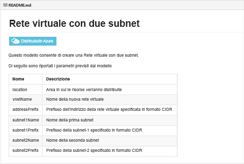
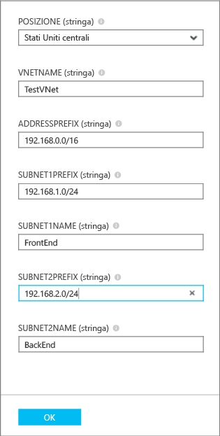
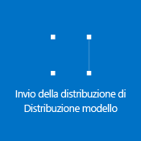

## Distribuire il modello ARM tramite clic per la distribuzione

È possibile riutilizzare modelli ARM predefiniti, caricarli in un archivio github gestito da Microsoft e renderli disponibili community. Questi modelli possono essere distribuiti immediatamente da github o scaricati e modificati in base alle proprie esigenze. Per distribuire un modello che crea una rete virtuale con due subnet, attenersi alla procedura seguente.

1. Da un browser, passare a [https://github.com/Azure/azure-quickstart-templates](https://github.com/Azure/azure-quickstart-templates).
2. Scorrere verso il basso nell'elenco dei modelli e fare clic su **101-vnet-two-subnets**. Controllare il file **README.md**, come illustrato di seguito.

	

3. Fare clic su **Distribuzione in Azure**. Se necessario, immettere le credenziali di accesso di Azure.
4. Nel pannello **Parametri**, immettere i valori da utilizzare per creare la nuova rete virtuale e quindi fare clic su **OK**. La figura seguente illustra i valori per questo scenario.

	

4. Fare clic su **Gruppo di risorse** e selezionare un gruppo di risorse a cui aggiungere la rete virtuale o fare clic su **Crea nuovo** per aggiungere la rete virtuale a un nuovo gruppo di risorse. La figura seguente illustra le impostazioni del gruppo di risorse per un nuovo gruppo di risorse denominato **TestRG**.

	

5. Se necessario, modificare le impostazioni per **Sottoscrizione** e **Percorso** per la rete virtuale.
6. Se non si desidera visualizzare la rete virtuale come un titolo nella **schermata iniziale**, disabilitare **Aggiungere a schermata iniziale**.
5. Fare clic su **Note legali**, leggere le condizioni e fare clic su **Acquista** per accettare. 
6. Fare clic su **Crea** per creare la rete virtuale.

	

7. Al termine della distribuzione, fare clic su **TestVNet** > **Tutte le impostazioni** > **Subnet** per visualizzare le proprietà delle subnet, come illustrato di seguito.

	

<!---HONumber=AcomDC_0323_2016-->