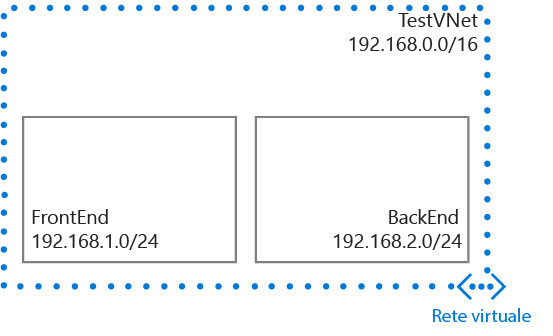

## Scenario
Per illustrare meglio come creare una rete virtuale e le relative subnet, in questo documento verrà utilizzato lo scenario seguente.

In questo scenario verrà creata una rete virtuale denominata **TestVNet** con blocco CIDR riservato **192.168.0.0./16**. Una rete virtuale conterrà le subnet seguenti: 

* **FrontEnd**, che usa **192.168.1.0/24** come blocco CIDR.
* **BackEnd**, che usa **192.168.2.0/24** come blocco CIDR.

