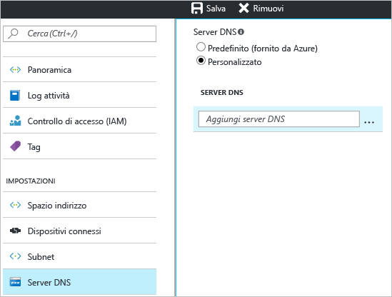

1. Nella pagina **Impostazioni** della rete virtuale passare a **Server DNS** e fare clic per aprire il pannello corrispondente.
2. Nell'area **Server DNS** della pagina **Server DNS** selezionare **Personalizzato**.
3. Nella casella di testo **Aggiungi server DNS** del campo **Server DNS** immettere l'indirizzo IP del server DNS che si intende usare per la risoluzione dei nomi. Dopo avere aggiunto i server DNS, fare clic su **Salva** nella parte superiore del pannello per salvare la configurazione.

  