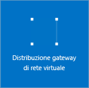

1. Nel portale passare a **Nuovo**, quindi scegliere **Rete**. Selezionare **Gateway di rete virtuale** dall'elenco.

	

2. Nel pannello **Crea gateway di rete virtuale** assegnare il nome del gateway nel campo **Nome**. Questa operazione non è come quella utilizzata per assegnare un nome alla subnet del gateway. Questo è il nome dell'oggetto gateway.
 
3. Scegliere quindi la rete virtuale in cui si vuole distribuire questo gateway. Fare clic sulla freccia per aprire il pannello **Scegliere una rete virtuale** e quindi fare clic sulla rete virtuale. Per visualizzare la rete virtuale nell'elenco, deve avere già una subnet del gateway valida.

4. Definire un indirizzo IP pubblico. Fare clic sulla freccia per aprire il pannello **Scegliere un indirizzo IP pubblico**. Fare quindi clic su **Crea nuovo** per aprire il pannello **Crea indirizzo IP pubblico**. Immettere un nome per l'indirizzo IP pubblico. Notare che non si tratta di richiedere un indirizzo IP. L'indirizzo IP viene assegnato in modo dinamico. Al contrario, questo è il nome dell'oggetto indirizzo IP a cui l'indirizzo viene assegnato. Fare clic su **OK** per salvare le modifiche.

5. Per **Tipo di gateway** selezionare il tipo di gateway specificato per la configurazione.

6. Per **Tipo VPN** selezionare il tipo di VPN specificato per la configurazione.

7. Per **Sottoscrizione** verificare che sia selezionata la sottoscrizione corretta.

8. Per **Gruppo di risorse**, questo viene determinato dalla rete virtuale selezionata.

9. Per **Località**, assicurarsi che sia visualizzata la località in cui si siano presenti sia il gruppo di risorse che la rete virtuale.

10. È possibile selezionare **Aggiungi al dashboard** se si vuole che il gateway venga visualizzato nel dashboard. Fare clic su **Crea** per iniziare a creare il gateway. Nel dashboard verrà visualizzato il riquadro relativo alla "distribuzione del gateway di rete virtuale". La creazione di un gateway può richiedere fino a 45 minuti. Le attività in background sono numerose. Potrebbe essere necessario aggiornare la pagina del portale per visualizzare lo stato di completamento.

	
	

11. Dopo la creazione del gateway, è possibile visualizzare l'indirizzo IP assegnato esaminando la rete virtuale nel portale. Il gateway viene visualizzato come un dispositivo connesso. È possibile fare clic sul dispositivo connesso ovvero il gateway di rete virtuale, per visualizzare altre informazioni.

