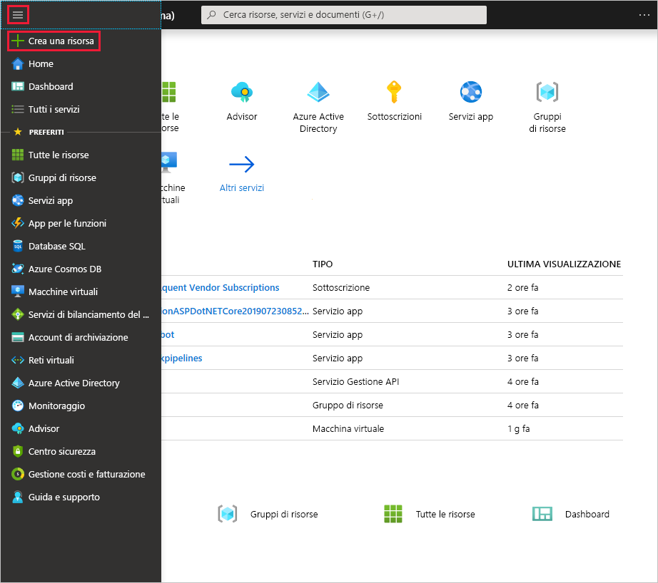
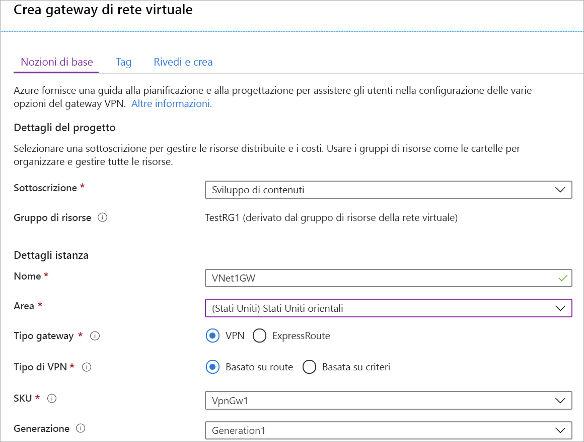
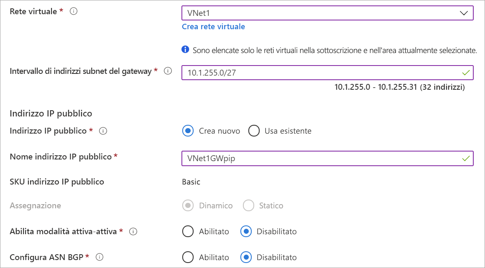

1. Scegliere **Crea una risorsa**dal menu [portale di Azure](https://portal.azure.com) . 

   
2. Nel campo **Cerca nel Marketplace** Digitare "gateway di rete virtuale". Individuare il **gateway di rete virtuale** nei risultati della ricerca e selezionare la voce. Nella pagina **gateway di rete virtuale** selezionare **Crea**. Verrà visualizzata la pagina **Crea gateway di rete virtuale**.
3. Nella scheda **nozioni di base** compilare i valori per il gateway di rete virtuale.

   

   

   **Dettagli del progetto**

   - **Sottoscrizione**: selezionare la sottoscrizione che si vuole usare dall'elenco a discesa.
   - **Gruppo di risorse**: questa impostazione viene riempita automaticamente quando si seleziona la rete virtuale in questa pagina.

   **Dettagli istanza**

   - **Nome**: assegnare un nome al gateway. La denominazione del gateway non equivale alla denominazione di una subnet del gateway. Si tratta del nome dell'oggetto gateway che verrà creato.
   - **Area**: selezionare l'area in cui si vuole creare la risorsa. L'area del gateway deve essere identica alla rete virtuale.
   - **Tipo di gateway**: selezionare **VPN**. I gateway VPN usano il gateway di rete virtuale di tipo **VPN**.
   - **Tipo VPN**: selezionare il tipo di VPN specificato per la configurazione. La maggior parte delle configurazioni richiede un tipo di VPN basato su route.
   - **SKU**: selezionare lo SKU del gateway dall'elenco a discesa. Gli SKU disponibili nell'elenco a discesa dipendono dal tipo di VPN selezionato. Per informazioni sugli SKU del gateway, vedere [SKU del gateway](../articles/vpn-gateway/vpn-gateway-about-vpn-gateway-settings.md#gwsku).
   - **Generazione**: per informazioni sulla generazione del gateway VPN, vedere [SKU del gateway](../articles/vpn-gateway/vpn-gateway-about-vpngateways.md#gwsku).
   - **Rete virtuale**: dall'elenco a discesa selezionare la rete virtuale a cui si vuole aggiungere il gateway.
   - **Intervallo di indirizzi subnet del gateway**: questo campo viene visualizzato solo se il VNet non dispone di una subnet del gateway. Se possibile, eseguire l'intervallo/27 o più grande (/26,/25 e così via). Non è consigliabile creare un intervallo inferiore a/28. Se si dispone già di una subnet del gateway, è possibile visualizzare i dettagli di GatewaySubnet passando alla rete virtuale. Fare clic su **subnet** per visualizzare l'intervallo. Se si desidera modificare l'intervallo, è possibile eliminare e ricreare il GatewaySubnet.

   **Indirizzo IP pubblico**: questa impostazione specifica l'oggetto indirizzo IP pubblico che viene associato al gateway VPN. L'indirizzo IP pubblico viene assegnato dinamicamente a questo oggetto durante la creazione del gateway VPN. L'indirizzo IP pubblico viene modificato solo quando il gateway viene eliminato e ricreato. Non viene modificato in caso di ridimensionamento, reimpostazione o altre manutenzioni/aggiornamenti del gateway VPN.

     - **Indirizzo IP pubblico**: lasciare selezionata l'opzione **Crea nuovo** .
     - **Nome dell'indirizzo IP pubblico**: digitare un nome per l'istanza dell'indirizzo IP pubblico nella casella di testo.
     - **Assegnazione**: il gateway VPN supporta solo Dynamic.

   **Modalità attivo-attivo**: selezionare **Abilita modalità attivo-attivo** solo se si sta creando una configurazione del gateway Active-Active. altrimenti lasciare l'impostazione non selezionata.

   Lasciare **Configura ASN BGP** deselezionata, a meno che la configurazione non richieda specificamente questa impostazione. Se è un'impostazione necessaria, il numero ASN predefinito è 65515, anche se può essere modificato.
4. Selezionare **Verifica + crea** per eseguire la convalida. Al termine della convalida, selezionare **Crea** per distribuire il gateway VPN. Un gateway può richiedere fino a 45 minuti per la creazione e la distribuzione completa. È possibile visualizzare lo stato della distribuzione nella pagina Panoramica per il gateway.

Dopo la creazione del gateway, è possibile visualizzare l'indirizzo IP assegnato esaminando la rete virtuale nel portale. Il gateway viene visualizzato come un dispositivo connesso.
