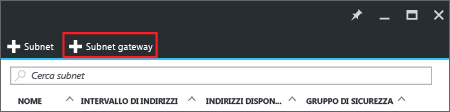
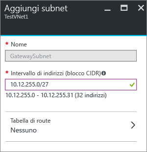

1. Nel portale passare alla rete virtuale a cui si vuole connettere un gateway.
2. Nella sezione **Impostazioni** del pannello della rete virtuale fare clic su **Subnet** per espandere il pannello Subnet.
3. Nel pannello **Subnet** fare clic su **+Subnet gateway** nella parte superiore. Verrà aperto il pannello **Aggiungi subnet** . 
   
    
4. Il **Nome** per la subnet verrà compilato automaticamente con il valore 'GatewaySubnet'. Questo valore è obbligatorio per consentire ad Azure di riconoscere la subnet come subnet del gateway. Modificare i valori di **Intervallo di indirizzi** compilati automaticamente in modo che corrispondano ai requisiti di configurazione.
   
    
5. Fare clic su **OK** nella parte inferiore del pannello per creare la subnet.

<!--HONumber=Nov16_HO2-->

