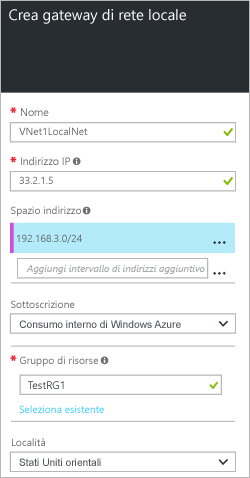

1. Nel portale passare a **Nuovo** > **Rete** > **Gateway di rete locale**.

	



2. Nel pannello **Crea un gateway di rete locale** specificare un **Nome** per l'oggetto gateway di rete locale.
 
3. Specificare un **Indirizzo IP** pubblico virtuale per il dispositivo VPN o il gateway di rete virtuale a cui ci si vuole connettere. Se la rete locale rappresenta una posizione locale, questo è l'indirizzo IP pubblico del dispositivo VPN a cui ci si vuole connettere. Non può essere protetto da NAT e deve essere raggiungibile da Azure. Se questa rete locale rappresenta un'altra rete virtuale, sarà necessario specificare l'indirizzo IP pubblico assegnato al gateway di rete virtuale per tale rete virtuale. 

4. Il valore di **Spazio di indirizzi** fa riferimento agli intervalli di indirizzi per la rete rappresentata da questa rete locale. È possibile aggiungere più intervalli di spazi indirizzi. Assicurarsi che gli intervalli specificati non si sovrappongano con gli intervalli di altre reti a cui ci si vuole connettere.
 
5. Per **Sottoscrizione** verificare che sia visualizzata la sottoscrizione corretta.

6. Per **Gruppo di risorse** selezionare il gruppo di risorse che si vuole usare. È possibile creare un nuovo gruppo di risorse o selezionarne uno già creato.

7. Per **Località** selezionare la località in cui verrà creato questo oggetto. È possibile, ma non necessario, selezionare la stessa località in cui risiede la rete virtuale.

8. Fare clic su **Crea** per creare il gateway di rete locale.

<!---HONumber=AcomDC_0810_2016-->