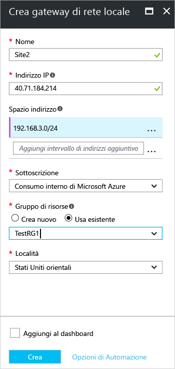

1. Nel portale fare clic su **+Aggiungi** in **Tutte le risorse**. 
2. Nella casella di ricerca del pannello **Tutto** digitare **Gateway di rete locale** e quindi fare clic per avviare la ricerca. Viene restituito un elenco. Fare clic su **Gateway di rete locale** per aprire il pannello e quindi su **Crea** per aprire il pannello **Crea un gateway di rete locale**.

  

3. Nel pannello **Crea un gateway di rete locale** specificare i valori per il gateway di rete locale.

  - **Nome:** specificare un nome per l'oggetto gateway di rete locale.
  - **Indirizzo IP:** l'indirizzo IP pubblico del dispositivo VPN a cui si vuole connettere Azure. Specificare un indirizzo IP pubblico valido: non può essere protetto da NAT e deve essere raggiungibile da Azure. Se al momento non si dispone dell'indirizzo IP, è possibile usare i valori visualizzati nella schermata, ma sarà necessario tornare indietro e sostituire l'indirizzo IP segnaposto con l'indirizzo IP pubblico del dispositivo VPN. In caso contrario, Azure non sarà in grado di connettersi.
  - **Spazio di indirizzi** fa riferimento agli intervalli di indirizzi per la rete rappresentata da questa rete locale. È possibile aggiungere più intervalli di spazi indirizzi. Assicurarsi che gli intervalli specificati non si sovrappongano con gli intervalli di altre reti a cui ci si vuole connettere. Azure indirizzerà l'intervallo di indirizzi specificato all'indirizzo IP del dispositivo VPN locale. *Usare i valori personalizzati, non i valori mostrati nello screenshot*.
  - **Sottoscrizione:** verificare che sia visualizzata la sottoscrizione corretta.
  - **Gruppo di risorse:** selezionare il gruppo di risorse che si vuole usare. È possibile creare un nuovo gruppo di risorse o selezionarne uno già creato.
  - **Località:** selezionare la località in cui verrà creato questo oggetto. È possibile, ma non necessario, selezionare la stessa località in cui risiede la rete virtuale.

4. Dopo aver specificato tutti i valori, fare clic su **Crea** nella parte inferiore del pannello per creare il gateway di rete locale.