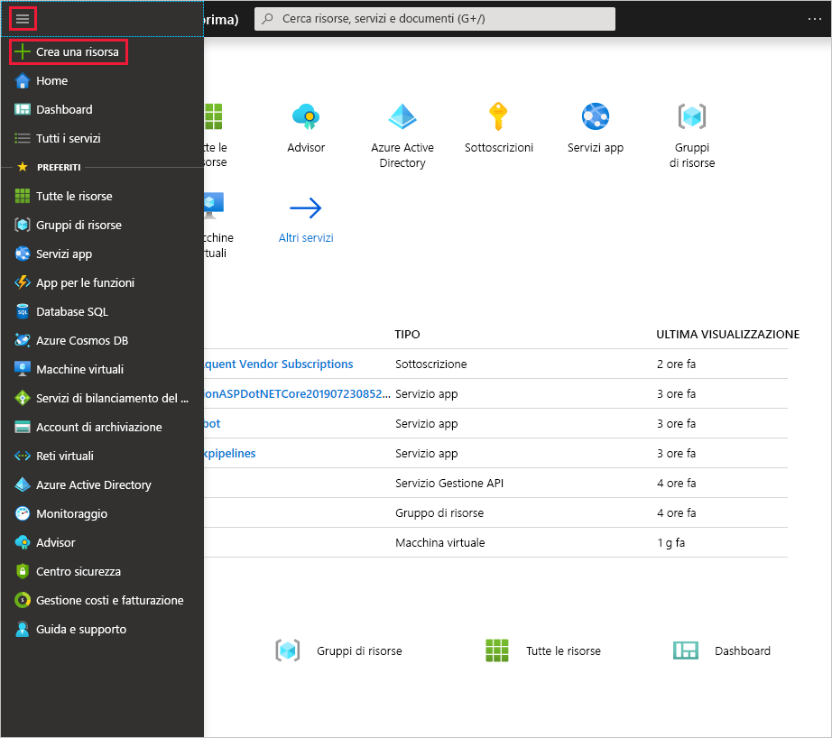
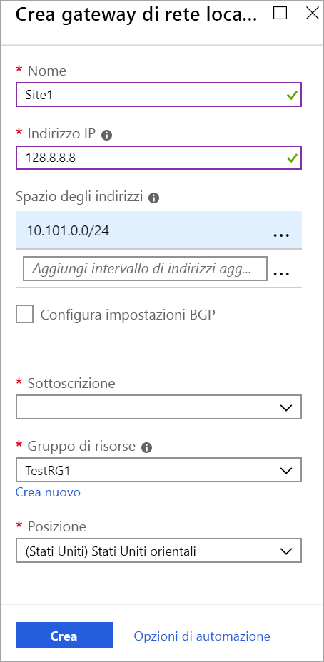

1. Scegliere **Crea una risorsa**dal menu [portale di Azure](https://portal.azure.com) . 

   
2. Nel campo **Cerca nel Marketplace** Digitare gateway di **rete locale**, quindi premere **invio** per eseguire la ricerca. Verrà restituito un elenco di risultati. Fare clic su **Gateway di rete locale**, quindi sul pulsante **Crea** per aprire la pagina **Crea un gateway di rete locale**.

   

3. Nella pagina **Crea un gateway di rete locale** specificare i valori per il gateway di rete locale.

   - **Nome:** specificare un nome per l'oggetto gateway di rete locale.
   - **Indirizzo IP:** l'indirizzo IP pubblico del dispositivo VPN a cui si vuole connettere Azure. Specificare un indirizzo IP pubblico valido: Se al momento non è disponibile l'indirizzo IP, è possibile usare i valori visualizzati nell'esempio, ma sarà necessario tornare indietro e sostituire l'indirizzo IP segnaposto con l'indirizzo IP pubblico del dispositivo VPN. In caso contrario, Azure non sarà in grado di connettersi.
   - **Spazio di indirizzi** fa riferimento agli intervalli di indirizzi per la rete rappresentata da questa rete locale. È possibile aggiungere più intervalli di spazi indirizzi. Assicurarsi che gli intervalli specificati non si sovrappongano con gli intervalli di altre reti a cui ci si vuole connettere. Azure indirizzerà l'intervallo di indirizzi specificato all'indirizzo IP del dispositivo VPN locale. *Usare valori personalizzati se si vuole stabilire la connessione con il sito locale, non i valori mostrati nell'esempio*.
   - **Configura le impostazioni BGP:** usare solo quando si configura BGP. In caso contrario, non selezionare questa opzione.
   - **Sottoscrizione:** verificare che sia visualizzata la sottoscrizione corretta.
   - **Gruppo di risorse:** selezionare il gruppo di risorse che si vuole usare. È possibile creare un nuovo gruppo di risorse o selezionarne uno già creato.
   - **Percorso:** Il percorso è lo stesso dell' **area** in altre impostazioni. selezionare la località in cui verrà creato questo oggetto. È possibile, ma non necessario, selezionare la stessa località in cui risiede la rete virtuale.

4. Dopo aver specificato tutti i valori, fare clic sul pulsante **Crea** nella parte inferiore della pagina per creare il gateway di rete locale.
