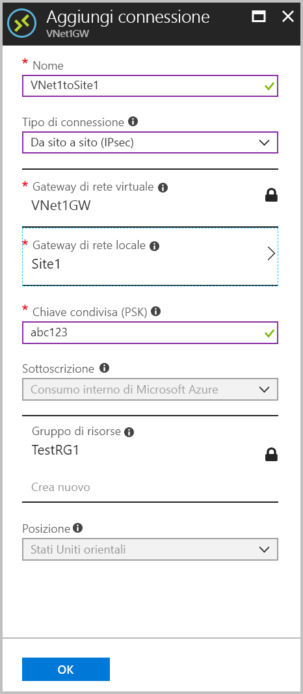

1. Individuare e aprire la pagina relativa al gateway di rete virtuale. Questa operazione può essere eseguita in vari modi. È possibile passare al gateway 'VNet1GW' passando a **TestVNet1 -> Panoramica -> Dispositivi connessi -> VNet1GW**.
2. Nella pagina di VNet1GW fare clic su **Connessioni**. Nella parte superiore della pagina Connessioni fare clic su **+Aggiungi** per aprire la pagina **Aggiungi connessione**.

   
3. Nella pagina **Aggiungi connessione** configurare i valori per la connessione.

   - **Nome:** assegnare un nome alla connessione.
   - **Tipo di connessione**: selezionare **Da sito a sito (IPSec)** .
   - **Gateway di rete virtuale:** questo valore è fisso perché la connessione viene eseguita da questo gateway.
   - **Gateway di rete locale:** fare clic su **Scegli un gateway di rete locale** e selezionare quello che si vuole usare.
   - **Chiave condivisa:** il valore di questo campo deve corrispondere a quello che si usa per il dispositivo VPN locale. L'esempio usa "abc123", ma è possibile e consigliabile usare un elemento più complesso. È importante che il valore specificato qui sia lo stesso valore specificato durante la configurazione del dispositivo VPN.
   - I restanti valori di **Sottoscrizione**, **Gruppo di risorse** e **Località** sono fissi.

4. Fare clic su **OK** per creare la connessione. Sullo schermo lampeggerà il messaggio *Creazione della connessione* .
5. È possibile visualizzare la connessione nella pagina **Connessioni** relativa al gateway di rete virtuale. Lo stato passa da *Sconosciuto* a *Connessione* e quindi a *Operazione riuscita*.
