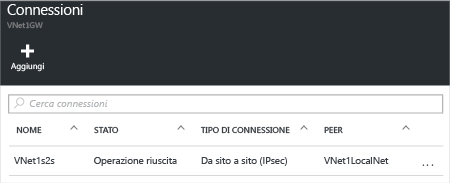

1. Individuare il gateway di rete virtuale e fare clic su **Tutte le impostazioni** per aprire il pannello **Impostazioni**.
2. Nel pannello **Impostazioni** fare clic su **Connessioni** e quindi su **Aggiungi** nella parte superiore del pannello per aprire il pannello **Aggiungi connessione**.
   
    
3. Nel pannello **Aggiungi connessione** assegnare un **nome** alla connessione. 
4. In **Tipo di connessione** selezionare **Da sito a sito (IPSec)**.
5. Il valore del campo **Gateway di rete virtuale**è fisso perché la connessione viene eseguita da questo gateway.
6. In **Gateway di rete locale** fare clic su **Scegli un gateway di rete locale** e selezionare quello che si vuole usare. 
7. Il valore del campo **Chiave condivisa**deve corrispondere a quello che si usa per il dispositivo VPN locale. Se il dispositivo VPN nella rete locale non fornisce una chiave condivisa, è possibile crearne una e immetterla sia in questo campo sia nel dispositivo locale. La cosa importante è che coincidano.
8. I restanti valori di **Sottoscrizione**, **Gruppo di risorse** e **Località** sono fissi.
9. Fare clic su **OK** per creare la connessione. Sullo schermo lampeggerà il messaggio *Creazione della connessione* .
10. Dopo avere completato la connessione, questa verrà visualizzata nel pannello **Connessioni** relativo al gateway.
    
    

