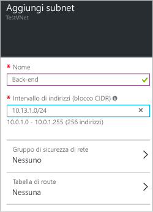

### Per aggiungere spazio di indirizzi
1. Per aggiungere altro spazio di indirizzi, fare clic su **Tutte le impostazioni** per aprire il pannello **Impostazioni**. 
2. Nel pannello **Impostazioni** fare clic su **Spazio di indirizzi** per aprire il pannello corrispondente. Aggiungere altro spazio di indirizzi in questo pannello e quindi fare clic su **Salva** nella parte superiore del pannello.
   
    

### Per aggiungere subnet
1. Per aggiungere altre subnet per gli spazi di indirizzi, nel pannello **Impostazioni** fare clic su **Subnet** per aprire il pannello **Subnet**. 
2. Nel pannello Subnet fare clic su **Aggiungi** per aprire il pannello **Aggiungi subnet**. Denominare la nuova subnet e specificare l'intervallo di indirizzi, quindi fare clic su **OK** nella parte inferiore del pannello. Dopo aver creato una subnet, è possibile usare il pannello Subnet per visualizzare tutte le subnet di una rete virtuale.

    

<!-----HONumber=AcomDC_0406_2016-->