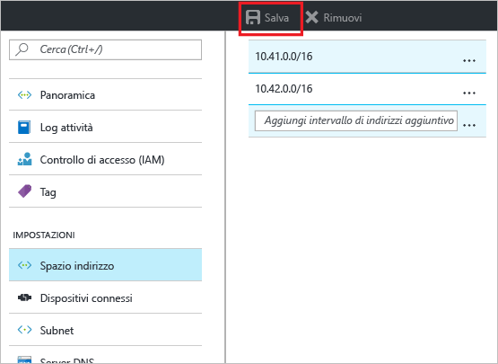
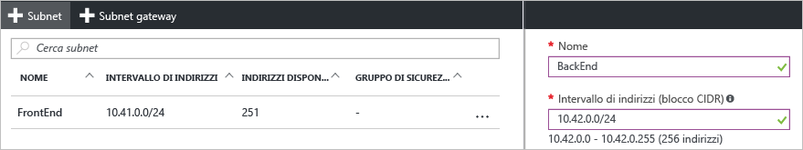

### Per aggiungere spazio di indirizzi
1. Per aggiungere altro spazio, nella sezione **Impostazioni** del pannello della rete virtuale fare clic su **Spazio indirizzi** per aprire il pannello Spazio indirizzi.
2. Aggiungere lo spazio indirizzi aggiuntivo e quindi fare clic su **Salva** nella parte superiore del pannello.
   
    

### Per creare le subnet
1. Per creare le subnet, nella sezione **Impostazioni** del pannello della rete virtuale, fare clic su **Subnet** per aprire il pannello **Subnet**. 
2. Nel pannello Subnet fare clic su **+Subnet** per aprire il pannello **Aggiungi subnet**. Assegnare un nome alla nuova subnet e specificare l'intervallo di indirizzi.
   
            
3. Fare clic su **OK** nella parte inferiore del pannello per salvare le modifiche.
   
    

