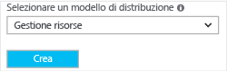
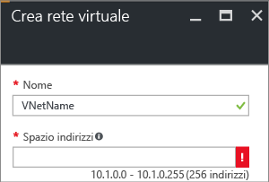
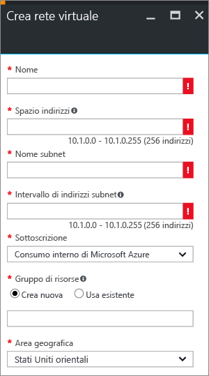
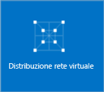

Per creare una rete virtuale nel modello di distribuzione Resource Manager usando il portale di Azure, seguire questa procedura. Gli screenshot sono forniti come esempi. Assicurarsi di sostituire i valori con i propri. Per altre informazioni sull'uso delle reti virtuali, vedere la [panoramica sulla rete virtuale](../articles/virtual-network/virtual-networks-overview.md).

1. In un browser passare al [portale di Azure](http://portal.azure.com) e, se necessario, accedere con l'account Azure.
2. Fare clic su **Nuovo**. Nel campo **Cerca nel Marketplace** digitare "Rete virtuale". Trovare **Rete virtuale** nell'elenco restituito e fare clic per aprire il pannello **Rete virtuale**.
   
    
3. Nella parte inferiore del pannello Rete virtuale selezionare **Resource Manager** nell'elenco **Selezionare un modello di distribuzione** e quindi fare clic su **Crea**.

    

1. Nel pannello **Crea rete virtuale** configurare le impostazioni della rete virtuale. Quando si compilano i campi, il punto esclamativo rosso diventa un segno di spunta verde quando i caratteri immessi nel campo sono validi.
   
    
2. Il pannello **Crea rete virtuale** ha un aspetto simile a quello dell'esempio seguente. Alcuni valori possono essere compilati automaticamente. In questo caso, sostituire i valori con quelli personalizzati.
   
    
3. **Nome**: immettere un nome per la rete virtuale.
4. **Spazio indirizzi**: immettere lo spazio degli indirizzi. Se si hanno più spazi di indirizzi da aggiungere, aggiungere il primo. È possibile aggiungere altri spazi di indirizzi in un secondo momento, dopo aver creato la rete virtuale.
5. **Nome subnet**: aggiungere il nome e l'intervallo di indirizzi della subnet. È possibile aggiungere altre subnet in un secondo momento, dopo aver creato la rete virtuale.
6. **Sottoscrizione**: verificare che sia visualizzata la sottoscrizione corretta. È possibile cambiare sottoscrizione tramite l'elenco a discesa.
7. **Gruppo di risorse**: selezionare un gruppo di risorse esistente o crearne uno nuovo digitandone il nome. Se si crea un nuovo gruppo, denominare il gruppo di risorse in base ai valori di configurazione pianificati. Per altre informazioni sui gruppi di risorse, vedere [Panoramica di Gestione risorse di Azure](../articles/azure-resource-manager/resource-group-overview.md#resource-groups).
8. **Località**: selezionare la località della rete virtuale. La località determina la posizione in cui risiedono le risorse distribuite in questa rete virtuale.
9. Selezionare **Aggiungi al dashboard** se si vuole trovare facilmente la rete virtuale nel dashboard e quindi fare clic su **Crea**.
   
   
10. Dopo aver fatto clic su **Crea**, verrà visualizzato un riquadro nel dashboard che riflette lo stato di avanzamento della rete virtuale. Il riquadro cambia durante la creazione della rete virtuale.
    
    

<!--HONumber=Nov16_HO2-->

