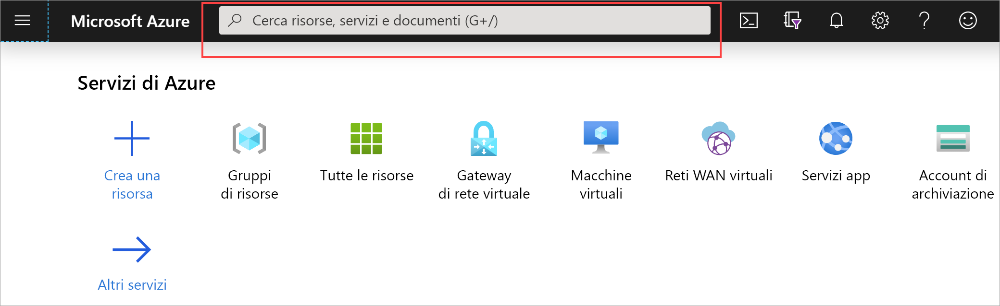
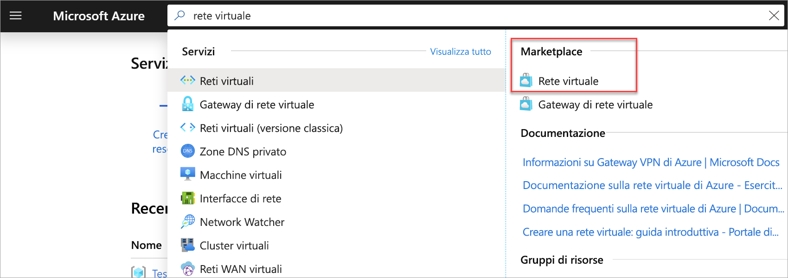
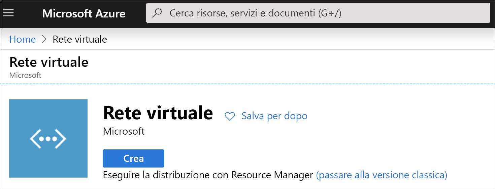
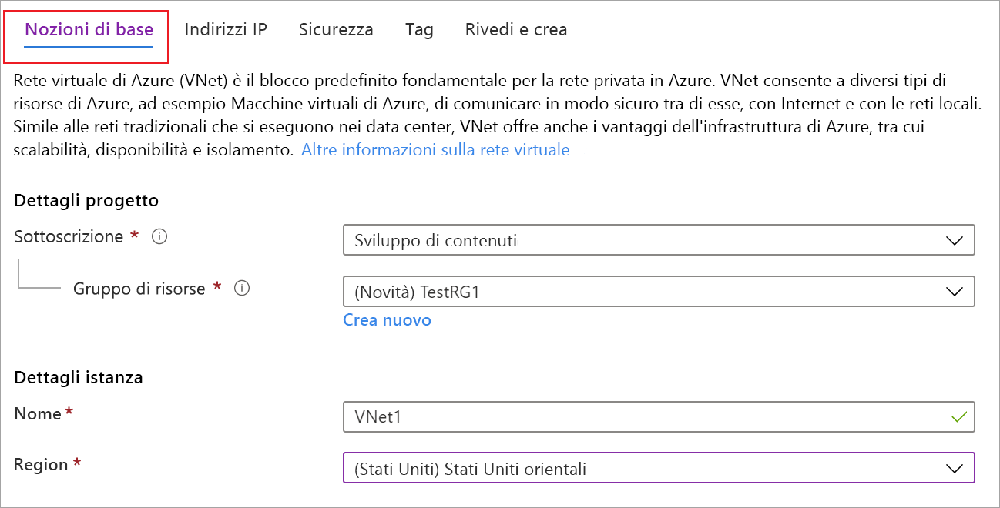
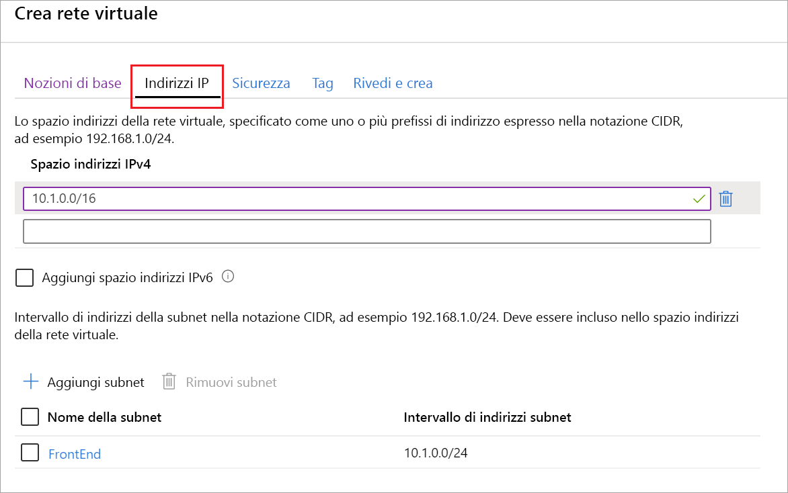

Seguendo questa procedura è possibile creare una rete virtuale con il modello di distribuzione Resource Manager e il portale di Azure. Per altre informazioni sulle reti virtuali, vedere la [panoramica di Rete virtuale](../articles/virtual-network/virtual-networks-overview.md).

>[!NOTE]
>Quando si usa una rete virtuale come parte di un'architettura cross-premise, assicurarsi di coordinarsi con l'amministratore di rete locale per suddividere un intervallo di indirizzi IP che è possibile usare in modo specifico per questa rete virtuale. Se su entrambi i lati della connessione VPN è presente un intervallo di indirizzi duplicato, il traffico verrà indirizzato in modo imprevisto. Inoltre, se si desidera connettere la rete virtuale a un'altra rete virtuale, lo spazio degli indirizzi non può sovrapporsi all'altra rete virtuale. Pianificare la configurazione di rete di conseguenza.
>
>

1. Accedere al [portale di Azure](https://portal.azure.com).
1. In **Cerca risorse, servizio e documenti (G +/)** Digitare *rete virtuale*.

   
1. Selezionare **rete virtuale** dai risultati del **Marketplace** .

   
1. Nella pagina **rete virtuale** selezionare **Crea**.

   
1. Dopo aver selezionato **Crea**, viene visualizzata la pagina **Crea rete virtuale** .
1. Nella scheda informazioni di **base** configurare i **Dettagli del progetto** e le impostazioni dell' **istanza** VNet.

    Quando si compilano i campi, viene visualizzato un segno di spunta verde quando i caratteri immessi nel campo vengono convalidati. Alcuni valori vengono inseriti automaticamente e possono essere sostituiti con valori personalizzati.

   - **Sottoscrizione**: verificare che la sottoscrizione elencata sia corretta. È possibile cambiare sottoscrizione tramite l'elenco a discesa.
   - **Gruppo di risorse**: selezionare un gruppo di risorse esistente oppure fare clic su **Crea nuovo** per crearne uno nuovo. Per ulteriori informazioni sui gruppi di risorse, vedere [Azure Resource Manager Overview](../articles/azure-resource-manager/management/overview.md#resource-groups).
   - **Nome**: immettere il nome della rete virtuale.
   - **Region**: selezionare la località per la VNet. La località determina la posizione in cui risiederanno le risorse distribuite nella rete virtuale.

1. Nella scheda **indirizzi IP** configurare i valori. I valori mostrati negli esempi seguenti sono a scopo dimostrativo. Modificare questi valori in base alle impostazioni richieste.

     
   - **Spazio degli indirizzi IPv4**: per impostazione predefinita, viene creato automaticamente uno spazio degli indirizzi. È possibile fare clic sullo spazio degli indirizzi per adattarlo per riflettere i valori personalizzati. È anche possibile aggiungere spazi di indirizzi aggiuntivi.
   - **IPv6**: se la configurazione richiede lo spazio degli indirizzi IPv6, selezionare la casella **Aggiungi spazio indirizzi IPv6** per immettere tali informazioni.
   - **Subnet**: se si usa lo spazio degli indirizzi predefinito, viene creata automaticamente una subnet predefinita. Se si modifica lo spazio degli indirizzi, è necessario aggiungere una subnet. Selezionare **+ Aggiungi subnet** per aprire la finestra **Aggiungi Subnet** . Configurare le impostazioni seguenti e quindi selezionare **Aggiungi** per aggiungere i valori:
      - **Nome subnet**: in questo esempio è stata denominata "front-end" della subnet.
      - **Intervallo di indirizzi subnet**: intervallo di indirizzi per la subnet.

1. A questo punto, nella scheda **sicurezza** , lasciare i valori predefiniti:

   - **Protezione DDoS**: di base
   - **Firewall**: disabilitato
1. Selezionare **Verifica + crea** per convalidare le impostazioni della rete virtuale.
1. Dopo aver convalidato le impostazioni, selezionare **Crea**.
