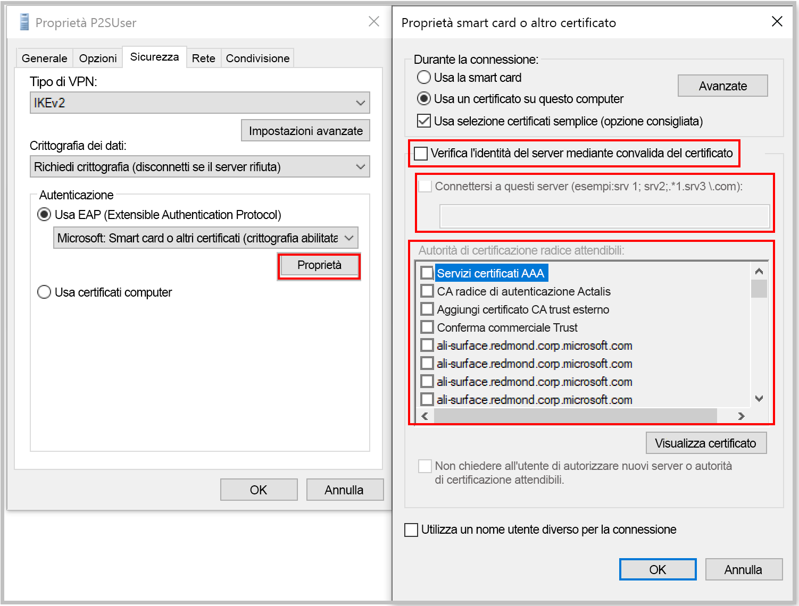

[!INCLUDE [P2S FAQ All](vpn-gateway-faq-p2s-all-include.md)]

### Che cosa è necessario fare se si verifica una mancata corrispondenza del certificato quando si effettua la connessione tramite autenticazione del certificato?

Deselezionare **"Verifica l'identità del server mediante convalida del certificato"** o **aggiungere il nome di dominio completo del server insieme al certificato** quando si crea un profilo manualmente. Per eseguire questa operazione, è possibile eseguire **rasphone** da un prompt dei comandi e selezionare il profilo dall'elenco a discesa.

Ignorare la convalida dell'identità del server non è consigliabile in generale, ma con l'autenticazione del certificato di Azure lo stesso certificato viene usato per la convalida del server nel protocollo di tunneling VPN (IKEv2/SSTP) e nel protocollo EAP. Poiché il certificato del server e il nome di dominio completo sono già convalidati dal protocollo di tunneling VPN, è ridondante convalidarli nuovamente in EAP.

### È possibile usare la CA radice della PKI interna per generare i certificati per la connettività da punto a sito?

Sì. In precedenza, era possibile utilizzare solo certificati radice autofirmati. È ancora possibile caricare 20 certificati radice.

### È possibile usare i certificati di Azure Key Vault?

No.

### Quali strumenti è possibile usare per creare certificati?

È possibile usare la propria soluzione di infrastruttura a chiave pubblica aziendale (PKI interna), Azure PowerShell, MakeCert e OpenSSL.

### Sono disponibili istruzioni per le impostazioni e i parametri dei certificati?

* **Soluzione PKI aziendale/PKI interna:** vedere la procedura per [generare i certificati](../articles/vpn-gateway/vpn-gateway-howto-point-to-site-resource-manager-portal.md#generatecert).

* **Azure PowerShell:** per la procedura, vedere l'articolo relativo ad [Azure PowerShell](../articles/vpn-gateway/vpn-gateway-certificates-point-to-site.md).

* **MakeCert:** per la procedura, vedere l'articolo relativo a [MakeCert](../articles/vpn-gateway/vpn-gateway-certificates-point-to-site-makecert.md).

* **OpenSSL:** 

    * Quando si esportano certificati, assicurarsi di convertire il certificato radice in Base64.

    * Per il certificato client:

      * Quando si crea la chiave privata, specificare una lunghezza di 4096.
      * Quando si crea il certificato, per il parametro *-extensions* specificare *usr_cert*.
