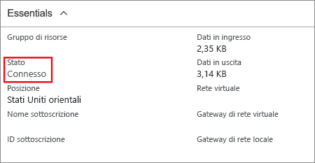

Nel portale di Azure è possibile visualizzare lo stato della connessione di un gateway VPN di Resource Manager passando alla connessione. La procedura seguente illustra uno dei modi in cui è possibile accedere alla connessione e verificarla.

1. Nel [portale di Azure](http://portal.azure.com) fare clic su **Tutte le risorse** e passare al gateway di rete virtuale.
2. Nel pannello del gateway di rete virtuale fare clic su **Connessioni**. È possibile visualizzare lo stato di ogni connessione.
3. Fare clic sul nome della connessione da verificare per aprire **Informazioni di base**. In Informazioni di base è possibile visualizzare altre informazioni sulla connessione. Dopo aver stabilito una connessione, lo **stato** visualizzato è "Operazione riuscita" e "Connesso".

  