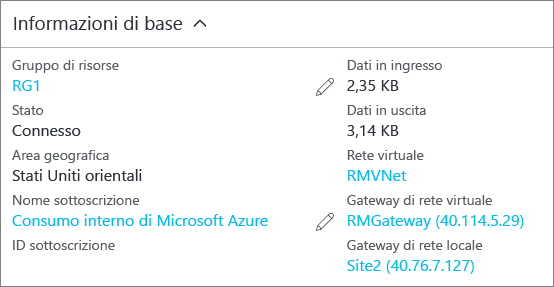

### <a name="to-verify-your-connection-by-using-powershell"></a>Per verificare la connessione tramite PowerShell

Per verificare l'esito positivo della connessione è possibile usare il cmdlet 'Get-AzureRmVirtualNetworkGatewayConnection' con o senza '-Debug'. 

1. Per configurare i valori in modo che corrispondano ai propri, usare l'esempio di cmdlet seguente. Quando richiesto, selezionare "A" per eseguire "Tutti". Nell'esempio, '-Name' fa riferimento al nome della connessione creata che si vuole testare.

  ```powershell
  Get-AzureRmVirtualNetworkGatewayConnection -Name MyGWConnection -ResourceGroupName MyRG
  ```
2. Al termine dell'esecuzione del cmdlet, visualizzare i valori. Nell'esempio seguente lo stato di connessione risulta "Connesso" ed è possibile visualizzare i byte in ingresso e in uscita.

  ```
  "connectionType": "IPsec",
  "routingWeight": 10,
  "sharedKey": "abc123",
  "connectionStatus": "Connected",
  "ingressBytesTransferred": 33509044,
  "egressBytesTransferred": 4142431
  ```

### <a name="to-verify-your-connection-by-using-the-azure-portal"></a>Per verificare la connessione usando il portale di Azure

Nel portale di Azure è possibile visualizzare lo stato della connessione passando alla connessione. Per eseguire questa operazione è possibile procedere diversi modi. La procedura seguente illustra uno dei modi in cui è possibile accedere alla connessione e verificarla.

1. Nel [portale di Azure](http://portal.azure.com) fare clic su **Tutte le risorse** e passare al gateway di rete virtuale.
2. Nel pannello del gateway di rete virtuale fare clic su **Connessioni**. È possibile visualizzare lo stato di ogni connessione.
3. Fare clic sul nome della connessione da verificare per aprire **Informazioni di base**. In Informazioni di base è possibile visualizzare altre informazioni sulla connessione. Dopo aver stabilito una connessione, lo **stato** visualizzato è "Operazione riuscita" e "Connesso".
   
    